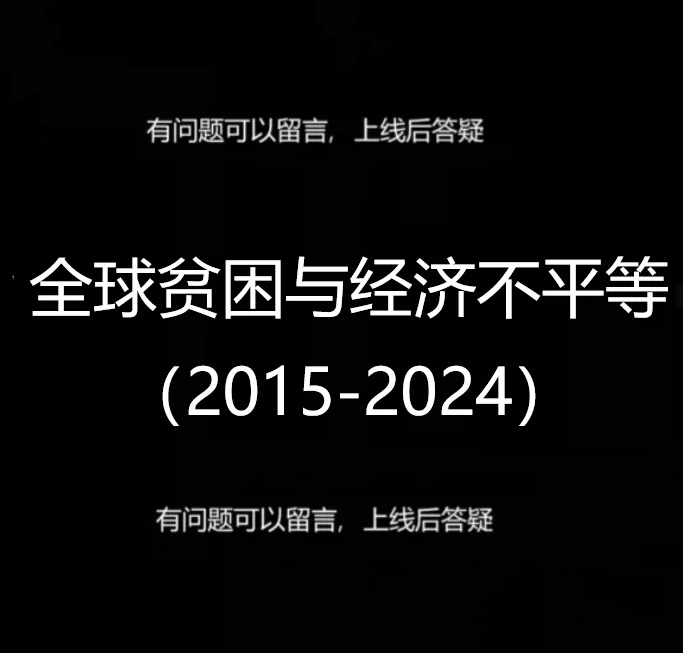
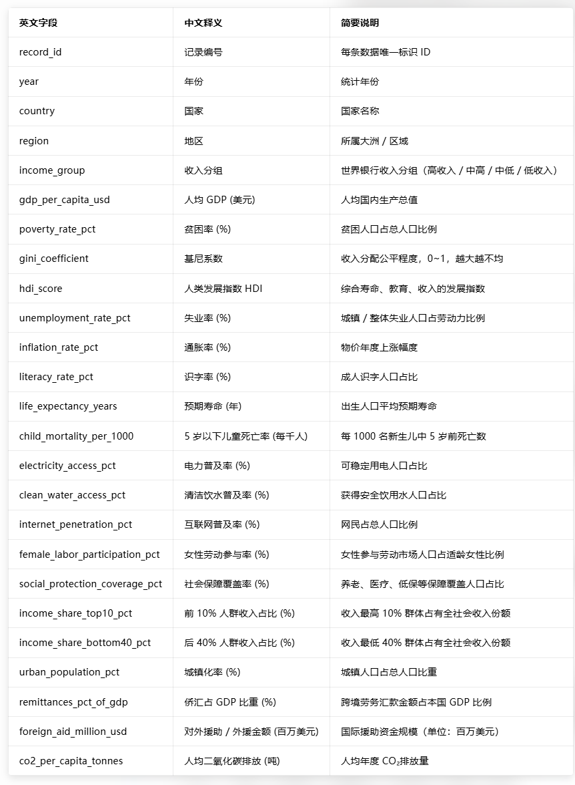
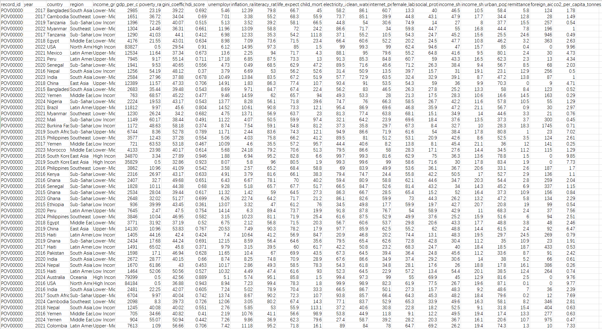
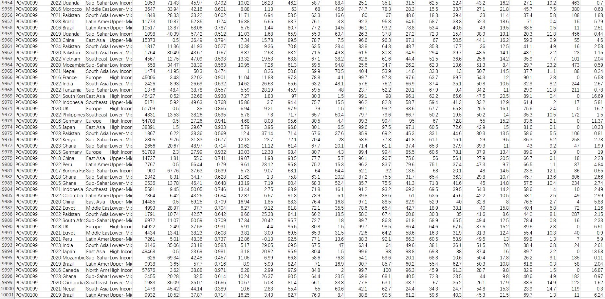

## Body

Global Poverty and Economic Inequality Dataset (2015-2024)

This comprehensive dataset captures the trends in global poverty and economic inequality from 2015 to 2024. It includes annual records for 10,000 countries across 40 countries and 7 world regions - covering income groups from low-income to high-income countries.

Synthetic Dataset
--------10,000 records × 25 features - zero null values
--------Global 7 regions with 40 countries
--------Trend data over ten years (2015–2024)
--------Inclusive of poverty, inequality, health, education, and infrastructure

Major Research Areas
--------Poverty rate trend by income group and region
--------Gini coefficient and income inequality analysis
--------Human Development Index (HDI) progress tracking
--------Access to infrastructure gaps (electricity, water, internet)
--------Women's labor participation and gender inequality
--------Trends in child mortality and life expectancy
--------Classification of income groups using machine learning
--------Analysis of impact of foreign aid and remittances

Specific statistical fields can be seen in the product images

## Images

Here is a pay link on Stripe ( https://buy.stripe.com/3cs8yP7sY87d0vu9AB ). Please contact me lonlonago@foxmail.com after funding $89, and I will send you a complete data files , thank you!

